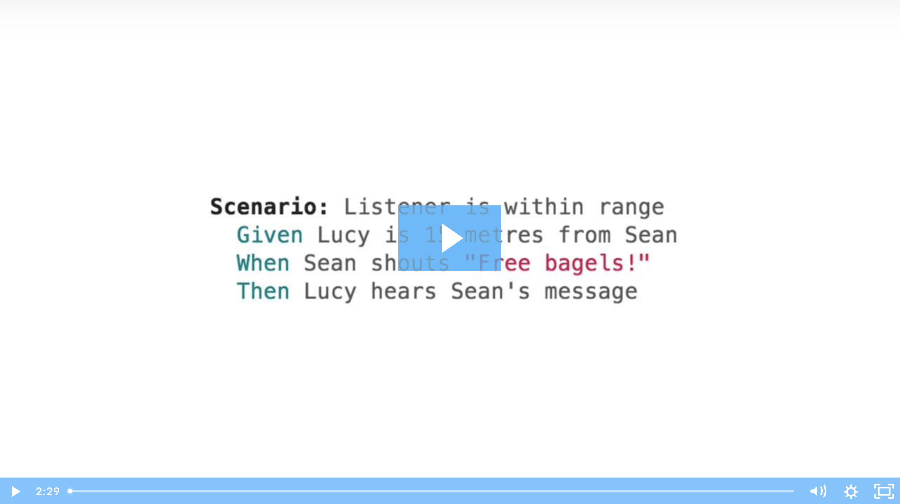
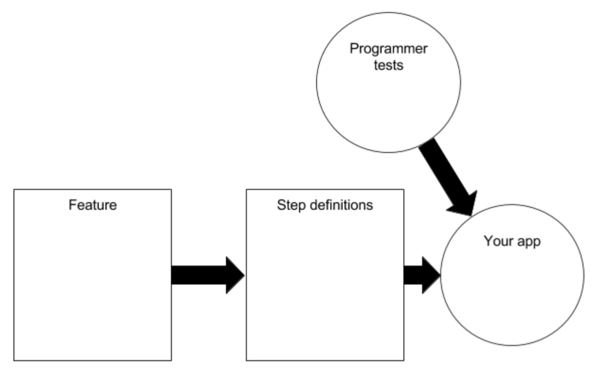

# Shouty - Python

This is a port of [Shouty](https://github.com/cucumber-examples/shouty.java) to Python and [Behave](https://github.com/behave/behave).

[The original Shouty](https://github.com/cucumber-ltd/shouty.java) is a [Cucumber](https://cucumber.io) open source training exercise that I first learned from [Seb Rose](https://leanpub.com/u/sebrose). Thanks, Seb!

Shouty is a social networking application for short physical distances.
When someone shouts, only people within 1000m can hear it.

[Watch the video:](https://cucumber.wistia.com/medias/acp9pov7u5)

Shouty doesn't exist yet&mdash;you will implement it yourself!

That is, if you're attending an awesome course on technical agility.

## You will need

1. A Python IDE (e.g. PyCharm)
2. Python 3
3. Behave support for your IDE (It's built-in to PyCharm)

## Get the code

Git:

    git clone https://github.com/rkasper/shouty-python.git

Or simply [download](https://github.com/rkasper/shouty-python/archive/refs/heads/step-1-start-here.zip) a zip and expand it into a directory on your computer.

## Import the project

In PyCharm

`File > Open`

Then browse to the directory where you downloaded `shouty-python` and open the directory. The project should now load.

## Install Python dependencies
Type: `pip install -r requirements.txt`

## Run the tests

On Mac or Linux:
- In PyCharm:
  - Right-click the file `test-all.sh` > Run 'test-all.sh'
- Or in a terminal:
  - Type: `./test-all.sh`

On Windows:
- In PyCharm:
  - Right-click the file `test-all.bat` > Run 'test-all.bat'
- Or in a terminal:
  - Type: `cmd.exe /c test-all.bat`

You should expect to see a couple of tests failing. If so, you're ready to roll!

## BDD with Shouty: A Hands-On Tutorial

The following exercises are adapted from the "BDD Workbook" by Seb Rose. We've included them here to guide you through the Shouty kata.

### Let's get started

1. Take a look at the project and try to work out what each part is doing. Look at the following diagram and decide where each file in the project belongs.  Write the file names here:

   - Feature files: ________________________________________________
   - Step Definition files: ________________________________________________
   - Programmer test files: ________________________________________________
   - Your app: ________________________________________________

2. Are there any files whose reason for existing is not clear? Which ones? Your answer: ________________________________________________

3. The feature file contains scenarios made up of steps. Each step causes Behave to look for a Python step definition to run. How does Behave decide which step definition to run for each step? Your answer: ________________________________________________

4. How does Behave decide which scenarios to run? Your answer: ________________________________________________

### What is Behave telling us?

1. Run all the programmer tests and Behave scenarios.

2. You should see a mixture of passing and failing scenarios and tests. Note down:
   - The name of a passing scenario: ________________________________________________
   - The name of a failing scenario: ________________________________________________
   - The name of a passing programmer test: ________________________________________________
   - The name of a failing programmer test: ________________________________________________

3. How would you explain to your product owner what is wrong with Shouty, based on what you see in the test results? Your answer: ________________________________________________

### Getting to green

1. Write the production code that will make the failing programmer test pass. You should not need to edit the feature file, the step definition file, or the programmer test file.

   HINT: There's a commented out line of code in the Coordinate file that will get the test passing.

2. Run all the tests again. Both programmer tests should be passing, but one of the scenarios should still be failing.

3. Does the code you have just uncommented look like a complete solution? Your answer: ________________________________________________

4. Open the programmer test file and uncomment the programmer test that is commented out. Run all the tests again.

5. Which programmer test(s) are failing? Which scenario(s) are failing? Your answer: ________________________________________________

6. Can you see what changes you have to make to get the new programmer test to pass?

   HINT: Use Pythagoras' theorem.

7. Keep working and running all the tests until you see all the programmer tests, steps, and scenarios pass.

#### What we just did
We’ve just moved into new territory in the BDD cycle diagram. Look at the diagram again.
Where are we now? What do we need to do next? Your answer: ________________________________________________

### Step definition arguments

1. Look at the Gherkin expressions for Sean and Lucy's positions: `Lucy is at {xCoord:d}, {yCoord:d}` and `Sean is at {xCoord:d}, {yCoord:d}`. They're almost identical except for the person's name.

2. Replace the person's name in the Gherkin expression with an output parameter so that the person's name is also passed to the step definition as an argument. Use `{name}` as the output parameter: `{name} is at {xCoord:d}, {yCoord:d}`

3. Update the step definition method to accept the new parameter. What type should the new parameter be? What's a good name for it?

4. Replace the hard-coded name in the body of the step definition method with the new parameter.

5. Run Behave. Did you get an AmbiguousStepDefinitionsException? Why? What do you need to do to fix it? Your answer: ________________________________________________

6. Run Behave again and check everything is still working as before.

## Credits

This README and the included exercises are based on:
- [The original Shouty kata](https://github.com/cucumber-examples/shouty.java) by [Cucumber Ltd.](https://cucumber.io)
- The BDD Workbook by Seb Rose

These materials have been adapted for use with the Python version of Shouty.